# Block Blast

Block Blast is a production-oriented iOS block puzzle game built with Swift,
SwiftUI, and SpriteKit. Players place shaped pieces on an 8x8 board, clear full
rows and columns, and progress through meta systems such as daily challenges,
season pass rewards, achievements, collections, weekly leagues, power-ups, and
premium purchases.

This README is written for engineers reviewing the codebase. It explains where
the important code lives, how the app is wired, and which commands are useful
for local verification.

## App Gallery

<p align="center">
  
  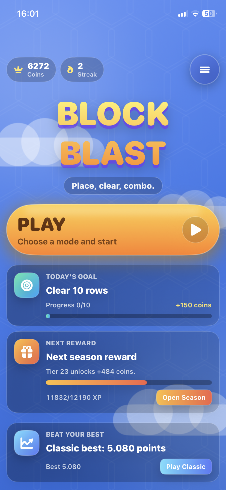
  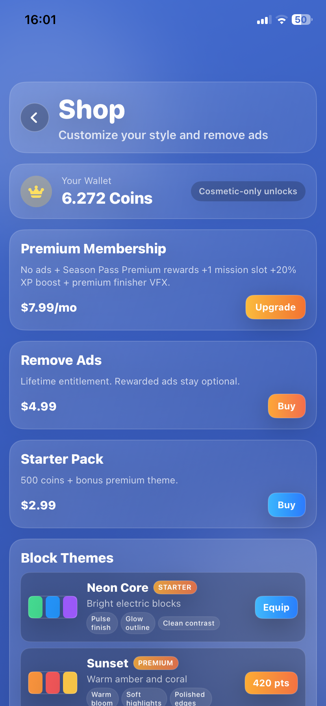
  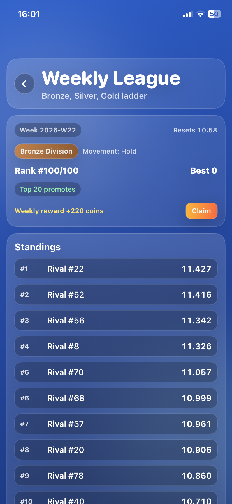
  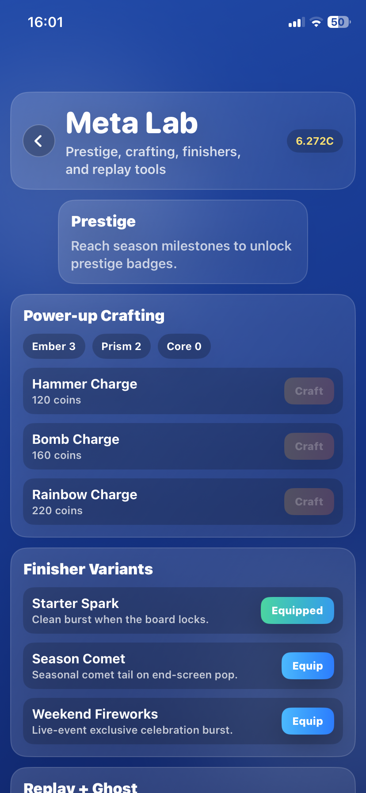
  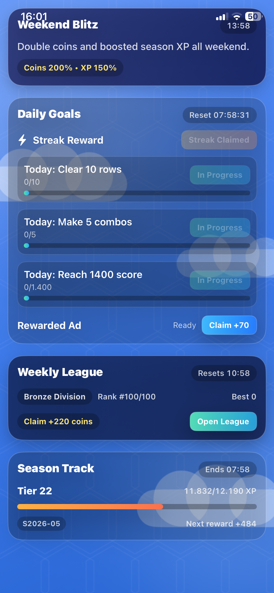
  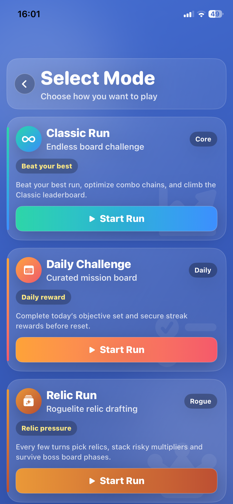
  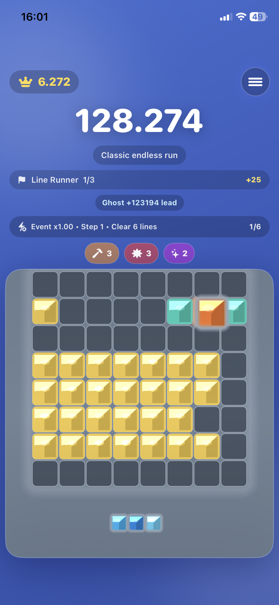
  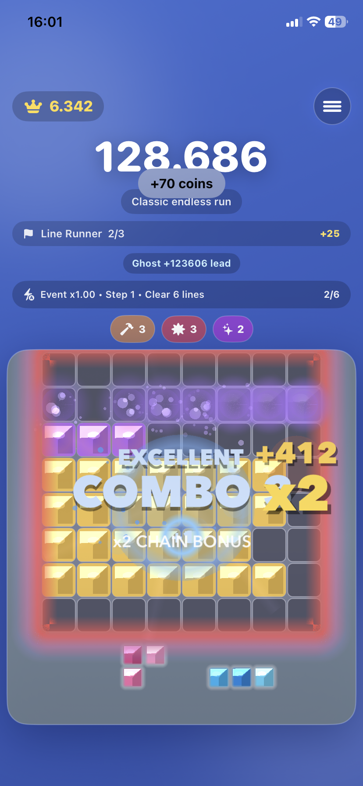
  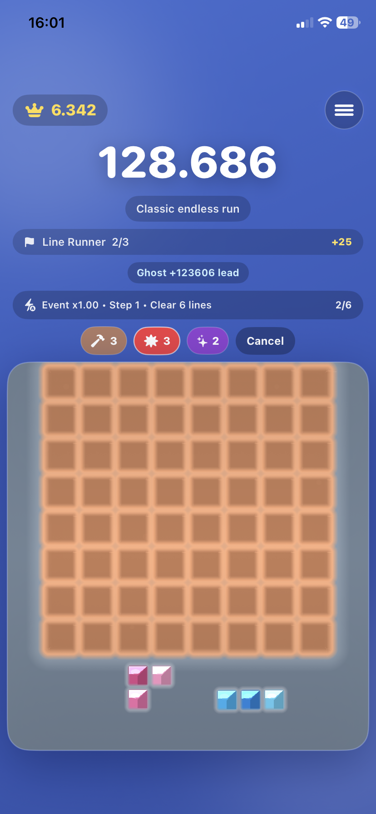
  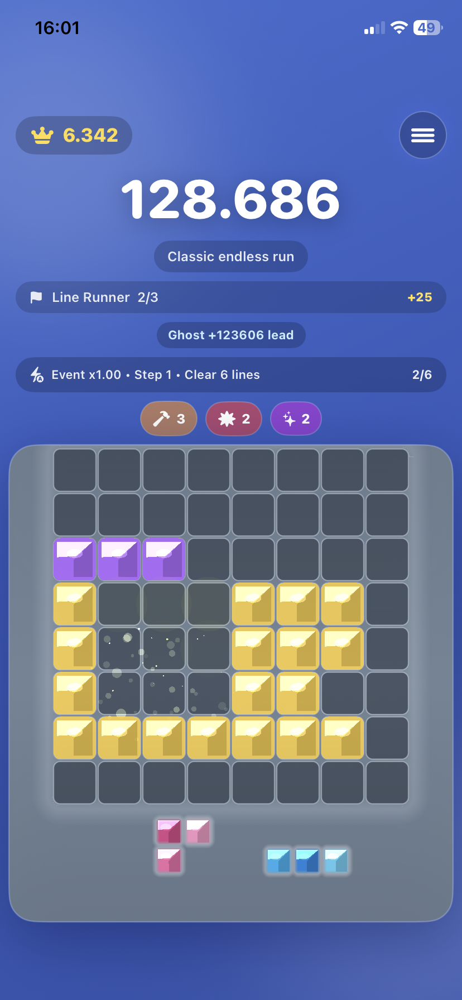
  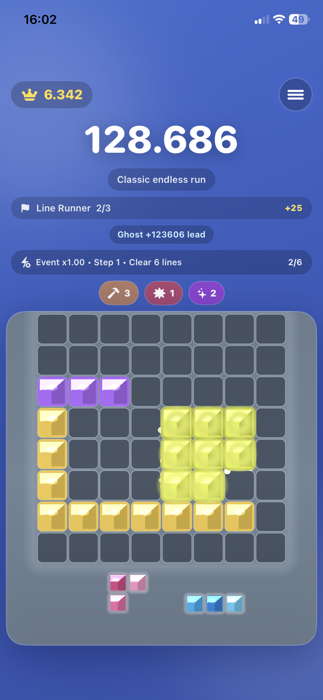
  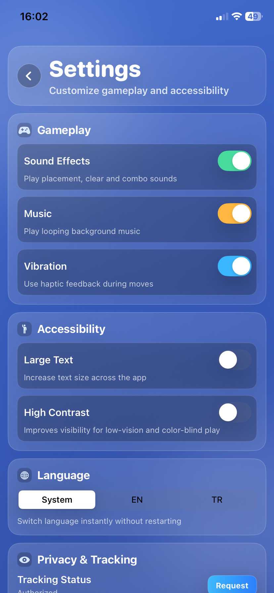
</p>

## Project Snapshot

| Item | Value |
| --- | --- |
| Platform | iOS |
| App target / scheme | `blockblast` |
| Bundle ID | `burakcoskun.blockblast` |
| Deployment target | iOS 18.4 as configured in `blockblast.xcodeproj` |
| UI | SwiftUI |
| Game rendering | SpriteKit |
| State model | Reducer-driven, deterministic game state |
| Persistence | `UserDefaults` through `KeyValueStore`, JSON save DTOs |
| Monetization | Rewarded ads, interstitial cadence, StoreKit 2 IAP |
| Social | Game Center leaderboards, friend challenges, weekly league |
| Localization | English and Turkish resource bundles |

## Gameplay and Product Scope

The core loop is:

```text
Home -> Mode Selection -> Game -> Results
```

Additional flows are available from Home, including Store, Settings, Season
Pass, Weekly League, Collection Album, and Meta Lab.

Implemented game modes:

- Classic
- Daily Challenge
- Relic Run
- Daily Seed Race
- Creator Challenge

Feature flags also contain scaffolded switches for Time Attack and Puzzle
Levels, but both are disabled by default.

## Architecture

The game uses unidirectional data flow for gameplay and a coordinator pattern
for navigation.

```text
User input
  -> GameAction
  -> GameReducer.reduce(state:action:)
  -> GameState + [GameEvent]
  -> GameEngine auto-save
  -> GameViewModel
  -> SwiftUI / SpriteKit rendering
```

Key architectural points:

- `GameReducer` owns all game-state mutation and should remain pure.
- `GameEngine` wraps the reducer and handles auto-save through
  `SaveGameStoreProtocol`.
- `GameScene` renders and handles board interaction, but domain logic belongs in
  `GameKit/Domain` and `GameKit/Engine`.
- `AppCoordinator` owns navigation through `NavigationStack`.
- `AppContainer` is the manual dependency injection root and creates app-wide
  services.
- Runtime feature availability is gated by both `FeatureFlags` and remote
  monetization config.
- Analytics events should be created through `AnalyticsFunnels`, not directly in
  views.

## Repository Layout

```text
.
|-- blockblast.xcodeproj/       # Xcode project
|-- blockblast/                 # Main app source target
|   |-- App/                    # App entry, coordinator, DI, config
|   |-- Core/                   # Foundation helpers, persistence, utilities
|   |-- GameKit/                # Domain rules, reducer, engine, rendering
|   |-- LiveOps/                # Remote config, events, messages, advanced systems
|   |-- Monetization/           # Ads, IAP, economy, products, paywall
|   |-- Observability/          # Analytics, crash reporting, FPS monitoring
|   |-- Presentation/           # SwiftUI screens, view models, design system
|   |-- Social/                 # Game Center, weekly league, share cards
|   |-- Scripts/                # Local QA, build, lint, preflight scripts
|   `-- Docs/                   # Phase docs and release notes
|-- blockblastTests/            # XCTest unit tests
|-- blockblastUITests/          # XCTest UI tests
|-- Config/                     # Entitlements
|-- Docs/project-knowledge/     # Reviewer and agent-oriented project notes
|-- fastlane/                   # Quality, beta, metadata, release lanes
|-- .github/workflows/          # CI and release workflows
`-- build/                      # Generated local build artifacts
```

## Important Files for Review

Start with these files when reviewing behavior:

- `blockblast/App/DI/AppContainer.swift` - service creation and dependency wiring.
- `blockblast/App/AppCoordinator.swift` - route handling, launch arguments, deep links.
- `blockblast/App/DI/FeatureFlags.swift` - compile-time feature defaults.
- `blockblast/App/Config/AppRuntimeConfig.swift` - runtime values read from Info.plist.
- `blockblast/GameKit/Engine/GameReducer.swift` - core gameplay state transitions.
- `blockblast/GameKit/Engine/GameEngine.swift` - reducer wrapper and auto-save behavior.
- `blockblast/GameKit/Domain/Models/GameState.swift` - central game state model.
- `blockblast/GameKit/Domain/Rules/GameModePolicy.swift` - mode availability and launch policy.
- `blockblast/Presentation/Screens/Game/GameViewModel.swift` - gameplay UI orchestration.
- `blockblast/Presentation/Screens/Game/GameSceneView.swift` - SwiftUI to SpriteKit bridge.
- `blockblast/LiveOps/RemoteConfig/RemoteTuning.swift` - remote config schema and fallback values.
- `blockblast/Monetization/Economy/MetaProgressionStore.swift` - coins, rewards, progression.
- `blockblast/Monetization/IAP/Products.swift` - StoreKit product catalog.
- `blockblast/Observability/Analytics/Events.swift` and
  `blockblast/Observability/Analytics/Funnels.swift` - analytics schema and factories.

## Configuration

Base runtime settings live in:

```text
blockblast/App/Config/BuildConfig.xcconfig
```

Optional local or production secrets should be placed in:

```text
blockblast/App/Config/BuildSecrets.xcconfig
```

Use the checked-in template as a starting point:

```text
blockblast/App/Config/BuildSecrets.xcconfig.example
```

Do not commit real tokens. Runtime config currently supports analytics ingest,
analytics auth, weekly league API settings, Game Center leaderboard IDs, deep
link scheme, and remote push registration.

## Local Setup

Prerequisites:

- macOS with Xcode installed
- iOS 18.4 simulator runtime, or adjust the destination to a simulator available
  on your machine
- Optional: SwiftLint for lint checks
- Optional: Fastlane for release automation

Open the project:

```bash
open blockblast.xcodeproj
```

Build from the command line:

```bash
xcodebuild \
  -project blockblast.xcodeproj \
  -scheme blockblast \
  -destination 'platform=iOS Simulator,name=iPhone 16 Pro Max,OS=18.4' \
  build
```

Run the full test suite:

```bash
xcodebuild \
  -project blockblast.xcodeproj \
  -scheme blockblast \
  -destination 'platform=iOS Simulator,name=iPhone 16 Pro Max,OS=18.4' \
  test
```

Run only unit tests:

```bash
xcodebuild \
  -project blockblast.xcodeproj \
  -scheme blockblast \
  -destination 'platform=iOS Simulator,name=iPhone 16 Pro Max,OS=18.4' \
  -only-testing:blockblastTests \
  test
```

Run only UI tests:

```bash
xcodebuild \
  -project blockblast.xcodeproj \
  -scheme blockblast \
  -destination 'platform=iOS Simulator,name=iPhone 16 Pro Max,OS=18.4' \
  -only-testing:blockblastUITests \
  test
```

## QA and Release Commands

Local scripts:

```bash
bash blockblast/Scripts/swiftlint.sh
bash blockblast/Scripts/device_matrix_test.sh
bash blockblast/Scripts/leak_check.sh
bash blockblast/Scripts/production_preflight.sh
```

Fastlane lanes:

```bash
fastlane ios quality_gate
fastlane ios qa_matrix
fastlane ios leak_check
fastlane ios production_preflight
fastlane ios beta
fastlane ios upload_metadata
fastlane ios release_ready
```

GitHub Actions:

- `.github/workflows/ci.yml` runs tests on pull requests and pushes to `main`,
  `develop`, and `codex/**`.
- `.github/workflows/release.yml` provides a manual TestFlight release pipeline.

## Launch Arguments and Deep Links

Useful launch arguments for testing:

| Argument | Effect |
| --- | --- |
| `--open-game-classic` | Launch into Classic mode |
| `--open-game-daily` | Launch into Daily Challenge |
| `--open-game-relic` | Launch into Relic Run |
| `--open-game-seed` | Launch into Daily Seed Race |
| `--open-store` | Launch into Store |

Supported deep link hosts for the `blockblast://` scheme include:

- `blockblast://store`
- `blockblast://modes`
- `blockblast://seedrace`
- `blockblast://leaderboard?mode=classic`
- `blockblast://creator?code=<challenge-code>`

## Testing Focus

The unit test target covers core rules, reducer flow, scoring, piece generation,
game-over detection, save/load, analytics schema, remote config, monetization,
season pass, achievements, power-ups, weekly league, and user preferences.

For gameplay changes, run the focused tests first:

- `PlacementRulesTests`
- `ClearRulesTests`
- `ScoringComboTests`
- `GameReducerFlowTests`
- `GameOverDetectionTests`
- `PieceBagFairnessTests`
- `RackGenerationTests`

For product or service changes, run the relevant tests:

- `RemoteConfigMonetizationTests`
- `RemoteGameplayTuningTests`
- `AnalyticsSchemaTests`
- `MetaProgressionTests`
- `SeasonPassTests`
- `WeeklyLeagueTests`
- `AppCoordinatorFlowTests`
- `UserPreferencesStoreTests`

## Review Notes and Guardrails

- Keep domain logic independent from SwiftUI and SpriteKit.
- Add new services through `AppContainer`.
- Add new screens through `AppRoute` and `AppCoordinator`.
- Add new gameplay state changes through `GameAction` and `GameReducer`.
- Keep persisted `Codable` models backward compatible.
- Use `GameModePolicy` for mode availability instead of ad-hoc checks.
- Respect `ConsentManager.canRequestAds` before requesting ads.
- Prefer typed analytics helpers in `AnalyticsFunnels`.
- Do not commit `BuildSecrets.xcconfig` or real production tokens.
